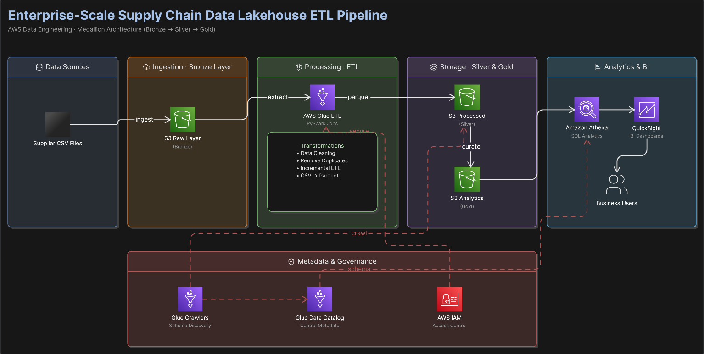
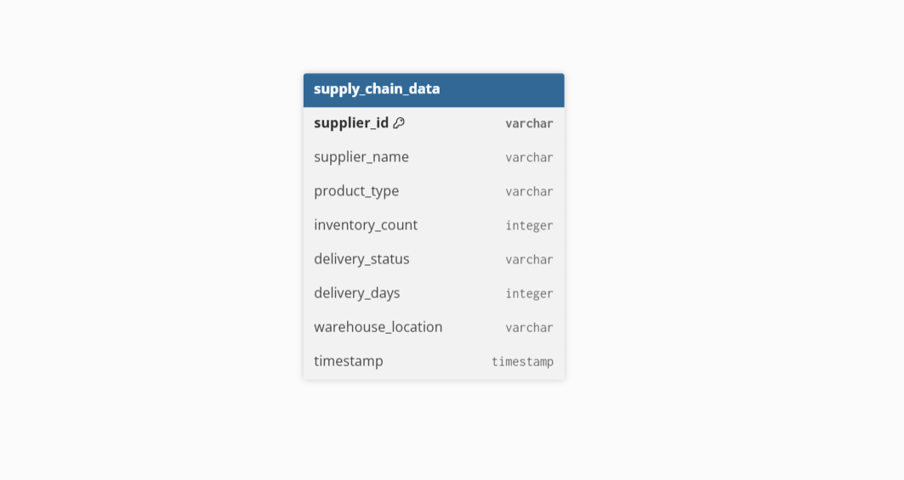

Copy this directly into your `README.md` file.

# 🚀 Enterprise Supply Chain Data Lakehouse ETL Pipeline on AWS

## 📌 Project Overview

This project demonstrates an end-to-end enterprise-scale AWS Data Engineering pipeline for Supply Chain Analytics using modern cloud-native data lakehouse architecture.

The pipeline simulates real-world supply chain operations where supplier, inventory, logistics, and shipment data are ingested, transformed, cataloged, analyzed, and visualized using AWS services.

This project focuses on:

* Enterprise ETL Processing
* Incremental Data Engineering
* AWS Glue PySpark Transformations
* Parquet Optimization
* Athena SQL Analytics
* Business Intelligence Dashboards using Amazon QuickSight

---

# 🏗️ Architecture Diagram



---

# 🧩 Data Model



---

# ⚡ End-to-End Pipeline Flow

```text
Supplier CSV Data
        ↓
Amazon S3 Raw Layer
        ↓
AWS Glue ETL (PySpark)
        ↓
Data Cleaning & Transformation
        ↓
Incremental ETL Processing
        ↓
CSV → Parquet Conversion
        ↓
Amazon S3 Processed Layer
        ↓
AWS Glue Crawler
        ↓
AWS Glue Data Catalog
        ↓
Amazon Athena SQL Analytics
        ↓
Amazon QuickSight Dashboard
```

---

# ☁️ AWS Services Used

| AWS Service       | Purpose                          |
| ----------------- | -------------------------------- |
| Amazon S3         | Raw & Processed Data Storage     |
| AWS Glue          | Serverless ETL Processing        |
| AWS Glue Crawler  | Automatic Schema Discovery       |
| AWS Glue Catalog  | Metadata Management              |
| Amazon Athena     | Serverless SQL Analytics         |
| Amazon QuickSight | Business Dashboard Visualization |
| AWS IAM           | Security & Access Management     |
| AWS CloudWatch    | Monitoring & Logs                |

---

# 🛠️ Tech Stack

* Python
* PySpark
* Pandas
* AWS Glue
* Amazon S3
* Amazon Athena
* Amazon QuickSight
* AWS Glue Catalog
* Parquet

---

# 📂 Project Structure

```text
enterprise-supply-chain-data-lakehouse-on-aws/
│
├── Architecture/
│   ├── architecture.png
│   └── data_model.png
│
├── Data/
│   ├── generate_supply_chain_data.py
│   └── supply_chain_data.csv
│
├── Glue_ETL/
│   └── supply_chain_etl_job.py
│
├── Athena/
│   └── athena_queries.sql
│
├── Dashboard/
│   └── dashboard.png
│
├── requirements.txt
└── README.md
```

---

# 🔄 ETL Transformations Performed

The AWS Glue ETL pipeline performs multiple enterprise-grade transformations:

* Data ingestion from Amazon S3
* Duplicate record removal
* Delayed shipment filtering
* Schema standardization
* Incremental ETL processing
* CSV to Parquet conversion
* Processed data optimization for analytics

---

# 📊 Amazon Athena Analytics

Athena was used for serverless SQL analytics directly on processed Parquet datasets stored in Amazon S3.

## Example Athena Query

```sql
SELECT supplier_name,
AVG(delivery_days) AS avg_delivery_days
FROM supply_chain_processed_data
GROUP BY supplier_name;
```

---

# 📈 Amazon QuickSight Dashboard

The project includes an interactive business intelligence dashboard built using Amazon QuickSight.

Dashboard Insights:

* Supplier performance analysis
* Delayed shipment monitoring
* Inventory trend analysis
* Product category analytics
* Delivery KPI visualization

---

# 📸 Dashboard Preview


---

# 🚀 Key Highlights

✅ Enterprise-Scale Data Lakehouse Architecture
✅ Incremental ETL Processing
✅ AWS Glue PySpark Transformations
✅ Optimized Parquet Storage
✅ Glue Catalog Integration
✅ Athena SQL Analytics
✅ Interactive QuickSight Dashboard
✅ End-to-End AWS Data Engineering Pipeline

---

# 🎯 Business Use Cases

This architecture can be extended for:

* Logistics analytics
* Procurement analytics
* Inventory optimization
* Shipment tracking
* Supplier performance monitoring
* Enterprise reporting systems

---

# 🧠 Learning Outcomes

Through this project, I gained practical experience with:

* Cloud-native ETL pipelines
* AWS data lakehouse architecture
* PySpark transformations
* Metadata management
* Serverless analytics
* Business intelligence dashboards
* Enterprise-scale AWS workflows

---

# 👨‍💻 Author

**Rohit**
Aspiring AWS Data Engineer

---
